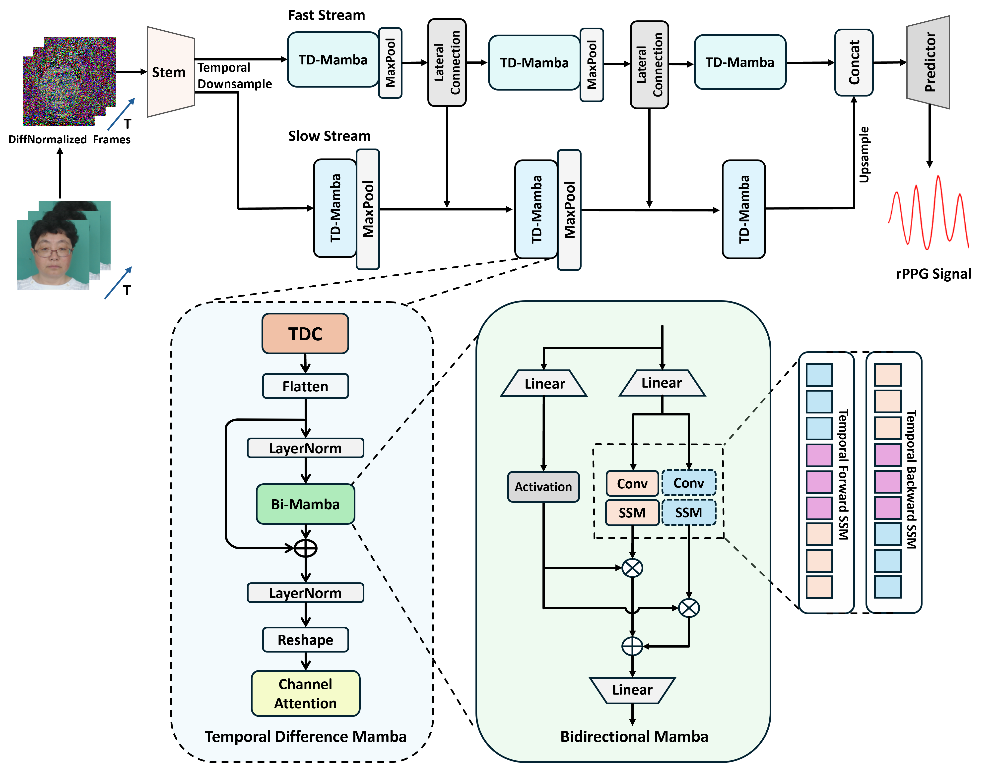

# PhysMamba

Codes of  paper **"PhysMamba: Efficient Remote Physiological Measurement with SlowFast Temporal Difference Mamba"** 
[Arxiv](https://arxiv.org/abs/2409.12031) Accepted by Chinese Conference on Biometric Recognition (CCBR 2024 Oral)



## Set up 

Code is based on **[rPPG-Toolbox](https://github.com/ubicomplab/rPPG-Toolbox)**

- **Environment**

```bash
conda create -n PRVMamba python=3.8
pip install torch==2.0.0 torchvision==0.15.1 torchaudio==2.0.1 --index-url https://download.pytorch.org/whl/cu118
```

- **CUDA Toolkit 11.8 (Must be installed on /usr/local/)**

```bash
mkdir -p $CONDA_PREFIX/etc/conda/activate.d
mkdir -p $CONDA_PREFIX/etc/conda/deactivate.d

vi $CONDA_PREFIX/etc/conda/activate.d/set_cuda11.sh

# ------------------------------------------------------ #
#!/bin/bash
# Original CUDA Backup
export OLD_CUDA_HOME=$CUDA_HOME
export OLD_PATH=$PATH
export OLD_LD_LIBRARY_PATH=$LD_LIBRARY_PATH

# CUDA 11.8 PATH
export CUDA_HOME=/usr/local/cuda-11.8
export PATH=$CUDA_HOME/bin:$PATH
export LD_LIBRARY_PATH=$CUDA_HOME/lib64:$LD_LIBRARY_PATH
# ------------------------------------------------------ #
chmod +x $CONDA_PREFIX/etc/conda/activate.d/set_cuda11.sh

vi $CONDA_PREFIX/etc/conda/deactivate.d/unset_cuda11.sh
# ------------------------------------------------------ #
#!/bin/bash
export CUDA_HOME=$OLD_CUDA_HOME
export PATH=$OLD_PATH
export LD_LIBRARY_PATH=$OLD_LD_LIBRARY_PATH

unset OLD_CUDA_HOME
unset OLD_PATH
unset OLD_LD_LIBRARY_PATH
# ------------------------------------------------------ #
chmod +x $CONDA_PREFIX/etc/conda/deactivate.d/unset_cuda11.sh
```

- **Install packages**

```bash
pip install -r requirements.txt
```

- **Install causal-conv1d**

```bash
pip install -e ./causal-conv1d
```

- **Install Mamba**

```bash
pip install -e ./mamba
```

# Datasets

* [MMPD](https://github.com/McJackTang/MMPD_rPPG_dataset)
    * Jiankai Tang, Kequan Chen, Yuntao Wang, Yuanchun Shi, Shwetak Patel, Daniel McDuff, Xin Liu, "MMPD: Multi-Domain Mobile Video Physiology Dataset", IEEE EMBC, 2023
    -----------------
         data/MMPD/
         |   |-- subject1/
         |       |-- p1_0.mat
         |       |-- p1_1.mat
         |       |...
         |       |-- p1_19.mat
         |   |-- subject2/
         |       |-- p2_0.mat
         |       |-- p2_1.mat
         |       |...
         |...
         |   |-- subjectn/
         |       |-- pn_0.mat
         |       |-- pn_1.mat
         |       |...
    -----------------

* [UBFC-rPPG](https://sites.google.com/view/ybenezeth/ubfcrppg)
    * S. Bobbia, R. Macwan, Y. Benezeth, A. Mansouri, J. Dubois, "Unsupervised skin tissue segmentation for remote photoplethysmography", Pattern Recognition Letters, 2017.
    -----------------
         data/UBFC-rPPG/
         |   |-- subject1/
         |       |-- vid.avi
         |       |-- ground_truth.txt
         |   |-- subject2/
         |       |-- vid.avi
         |       |-- ground_truth.txt
         |...
         |   |-- subjectn/
         |       |-- vid.avi
         |       |-- ground_truth.txt
    -----------------


* [PURE](https://www.tu-ilmenau.de/universitaet/fakultaeten/fakultaet-informatik-und-automatisierung/profil/institute-und-fachgebiete/institut-fuer-technische-informatik-und-ingenieurinformatik/fachgebiet-neuroinformatik-und-kognitive-robotik/data-sets-code/pulse-rate-detection-dataset-pure)
    * Stricker, R., Müller, S., Gross, H.-M.Non-contact "Video-based Pulse Rate Measurement on a Mobile Service Robot"
    in: Proc. 23st IEEE Int. Symposium on Robot and Human Interactive Communication (Ro-Man 2014), Edinburgh, Scotland, UK, pp. 1056 - 1062, IEEE 2014
    -----------------
         data/PURE/
         |   |-- 01-01/
         |      |-- 01-01/
         |      |-- 01-01.json
         |   |-- 01-02/
         |      |-- 01-02/
         |      |-- 01-02.json
         |...
         |   |-- ii-jj/
         |      |-- ii-jj/
         |      |-- ii-jj.json
    -----------------

# Train

### Cross-dataset

- **Training on UBFC-rPPG and Test on PURE**

1. Modify the configuration file `./configs/train_configs/UBFC-rPPG_UBFC-rPPG_PURE_PHYSMAMBA`
2. Run `python main.py --config_file ./configs/train_configs/UBFC-rPPG_UBFC-rPPG_PURE_PHYSMAMBA.yaml`

- **Training on PURE and Test on UBFC-rPPG**

1. Modify the configuration file `./configs/train_configs/PURE_PURE_UBFC-rPPG_PHYSMAMBA_BASIC.yaml`
2. Run `python main.py --config_file ./configs/train_configs/PURE_PURE_UBFC-rPPG_PHYSMAMBA_BASIC.yaml`

### Intro-dataset on UBFC-rPPG

1. Modify the configuration file `./configs/train_configs/UBFC_INTRO_PHYSMAMBA.yaml`
2. Run `python main.py --config_file ./configs/train_configs/UBFC_INTRO_PHYSMAMBA.yaml`

# Citation

```latex
@inproceedings{luo2024physmamba,
  title={PhysMamba: Efficient Remote Physiological Measurement with SlowFast Temporal Difference Mamba},
  author={Chaoqi Luo and Yiping Xie and Zitong Yu},
  booktitle={Chinese Conference on Biometric Recognition (CCBR)},
  year={2024}
}
```

